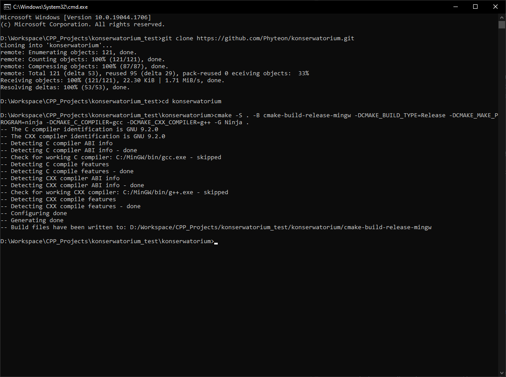
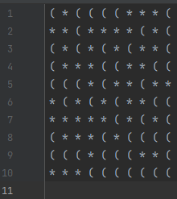
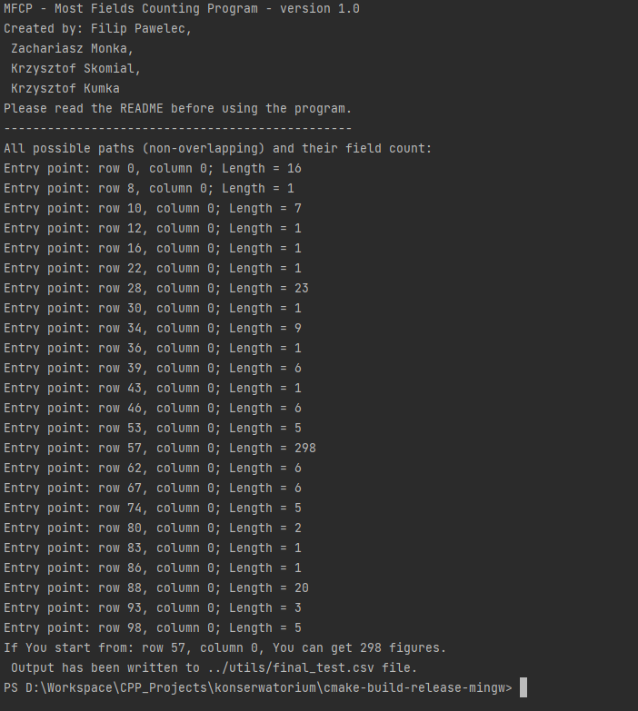
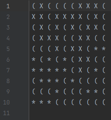

# Computer-aided mathematical problem-solving: final project

## 1. The task

The goal of this project is to write a C++ program that will solve a given problem based on graph theory.
Any input data should be read from a text file, and the program can output on stdout or into another file.

Our problem is as follows:
 - matrix of dimensions MxM is the input of the program
 - matrix contains only two types of values
 - starting point is a cell from one of the edges of the matrix (1 column, M column, 1 row or M row)
 - from that point, find the route meeting certain conditions, where travel is only allowed through cells of one chosen value type
 - movements are allowed only to neighbouring cells (but not diagonally), including moving to previously visited cells
 - the conditions of the route are: number of moves doesn't matter, only the number of visited cells of given type matter, 
   route must lead to the same edge as the starting edge

## 2. Project assumptions

 - format of the input data shall be .csv file
 - two symbols will be used to represent data (according to original task description written in Polish): * as the Sun and ( as the Moon
 - as starting edge, first column is chosen
 - as an output, program will write to stdout a complete route calculated (so that all steps taken will be visible)

## 3. Responsibilities division

 - Filip Pawelec - reading from files, cmake, dependencies
 - Krzysztof Skomiał - algorithm implementation
 - Krzysztof Kumka - algorithm implementation
 - Zachariasz Mońka - algorithm implementation

## How to build the project

The project was build & tested on standard MinGW toolchain for Windows and GNU toolchain on one of debian Linux distros (Ubuntu),
utilising Cmake as basis for generating necessary environment and Ninja as build system. The setup is as follows:

1. Please make sure that You have all the necessary tools with correct versions - they don't
have to be identical, but they have to be compatible:

- [CMake version 3.21.0-rc3](https://cmake.org/files/v3.21/)
- [Ninja, release 1.11.0](https://github.com/ninja-build/ninja/releases)
- [MinGW gcc, g++ version 9.2.0](https://osdn.net/projects/mingw/downloads/68260/mingw-get-setup.exe/)

2. If the project is being set up for the first time, please fire up the terminal ***in the project directory*** and
type in the following command:

```commandline
cmake -S . -B cmake-build-release-mingw -DCMAKE_BUILD_TYPE=Release -DCMAKE_MAKE_PROGRAM=<path_to_build_program> -DCMAKE_C_COMPILER=<path_to_c_compiler> -DCMAKE_CXX_COMPILER=<path_to_cxx_compiler> -G Ninja .
```

IMPORTANT TO NOTE! If CMake executable is not in Your PATH system variable, You'll have to provide full path to the executable Yourself.
Same goes for compilers and build system - if paths to them are in the PATH variable, You don't have to provide full paths UNLESS
You have multiple versions installed.

If anything goes wrong during this command, please check for correct syntax and if it was executed in the correct
directory. The output should look similar to this:



If any directory has been created from this command when it ***failed***, before re-running the command please delete that
directory and its contents.

3. If the above command has completed, the next command can be typed:
```commandline
cmake --build cmake-build-release-mingw --target konserwatorium
```

After the above command finishes, it should produce an executable file in *cmake-build-release-mingw* directory.

## How to run the project

Before running the program, You'll have to provide some input data first. The format of input data is as follows:

 - fields that we are able to step on are marked as "*"
 - fields we aren't allowed to step on are marked as "("
 - each field is divided by a space sign
 - after each row, a newline character is required
 - file with input data does not contain any metadata - it is plain

Summing up, input file should look like this:



For Your convenience, in the *utils* directory there is a python script for generating random input data. But please
check the generated data, as it is 100% random and, for example, may not contain any entry point in the specified starting
edge. The python script may be invoked from command line; when invoked with *--help* it will print out short info
on how to use it. The script only requires standard python libraries to run, and was tested on Python 3.10 interpreter.
To run the script, the most reliable way (always works) is to specify the script as an argument to the interpreter in the
command line. Please check what is the correct interpreter invocation command on Your system - it will be probably *py*
or *python3*. The easiest way to make sure is to write expected interpreter invocation command with *--version* argument.
If it is the correct command, it will print python version currently invoked. Example command might be as follows:

```commandline
./data_generator.py 1000 -f test1.csv
```

After generating or manually specifying the input file, the built executable *konserwatorium.exe* should be called with
the following arguments:

 - *path_to_input_file* - valid path to the input data path,
 - *path_to_output_file* - valid path to the output data file path (if file doesn't exist, it will be created),
 - *--verbose_off* - OPTIONAL argument. It disables logging possible paths to console.

If Your terminal window is open in *cmake-build-release-mingw* directory, an example of the usage may be as follows:

```commandline
./konserwatorium.exe ../utils/test1.csv ../utils/cmd_out.csv
```
In the output file, the chosen path will be marked with "X". A normal process output can be seen below:



For the example input file provided above, the output looks like this:



## Performance

The program was tested with matrix of size 1000x1000 and no issues were found. Bigger matrices were not tested for
practicality reasons. IMPORTANT! The maximum size of input matrix may be determined by Your operating system and
Your hardware. 